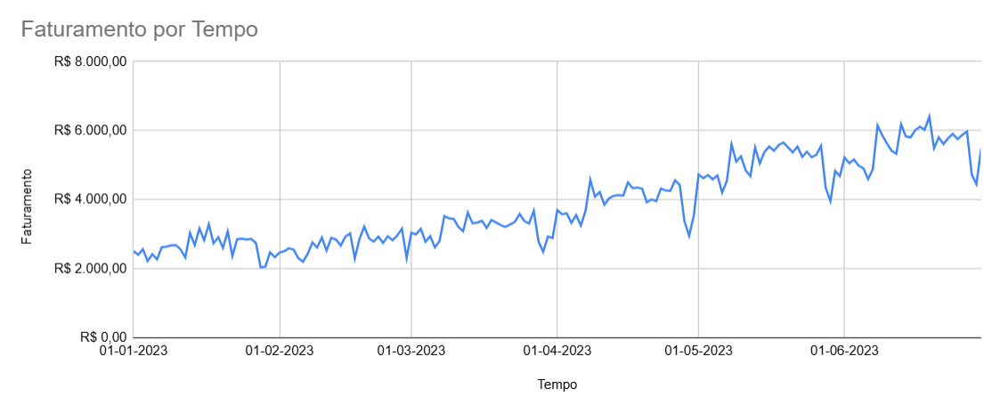
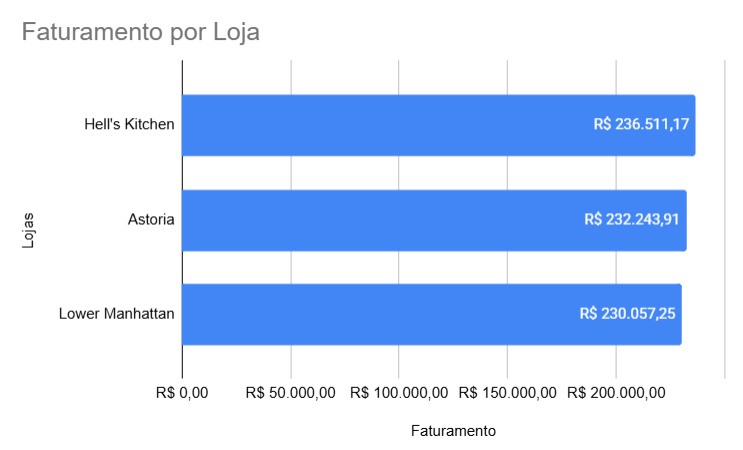
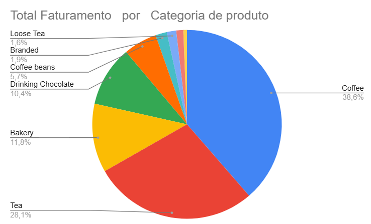
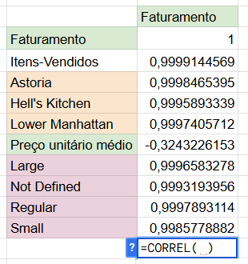
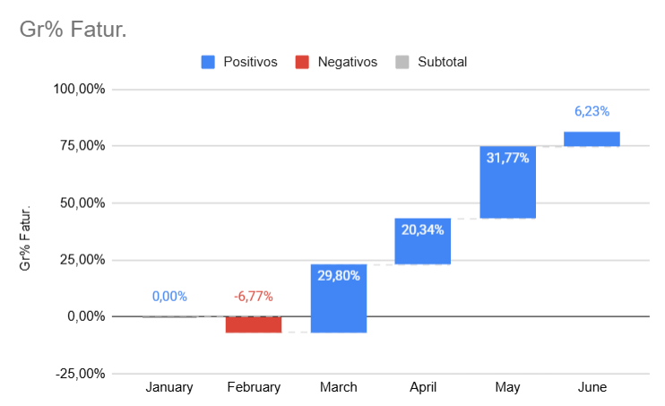
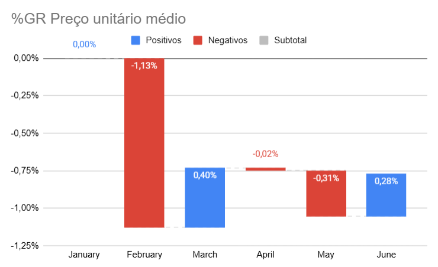
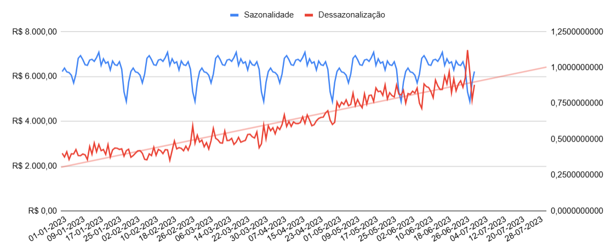
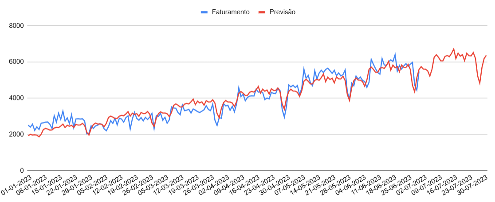
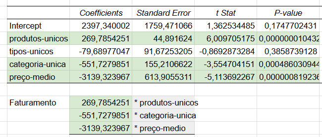

# Projeto de Análise de Dados — Rede de Cafeterias

* 1 Análise Descritiva
* 2 Análise Diagnóstica
* 3 Análise Preditiva
* 4 Análise Prescritiva

## Visão Geral

Este projeto tem como objetivo transformar dados operacionais de uma rede de cafeterias em **insights estratégicos**, utilizando técnicas de análise descritiva, diagnóstica, preditiva e prescritiva.

A abordagem aplicada permite não apenas entender o passado, mas também **prever cenários futuros e orientar decisões de negócio**.

---

## Objetivo de Negócio

* Identificar os principais drivers de faturamento
* Compreender o comportamento das vendas ao longo do tempo
* Prever demanda futura
* Apoiar decisões estratégicas baseadas em dados

---

# 1. Análise Descritiva — O que aconteceu?

A análise descritiva permitiu uma visão geral do desempenho da rede.

📌1 (aqui o gráfico de faturamento ao longo do tempo)

  

 

📌2 (aqui o gráfico de faturamento por loja)

  

 

📌3 (aqui o gráfico de produtos mais vendidos)

  

 

### Insights:

* Identificação dos produtos com maior volume e impacto no faturamento
* Todas as lojas tiverem desempenho igual com faturamentos semelhantes
* Os produtos mantiveram o mesmo padrão de venda independente da loja
* Distribuição de receita ao longo do tempo
* Padrões iniciais de comportamento de vendas

---

# 2. Análise Diagnóstica — Por que aconteceu?

Nesta etapa, foram investigadas as causas dos padrões observados.

📌4 (aqui a tabela de Correlacionamento de variaveis)

  

 

📌5 e 6 (aqui o Preço unitário médio e Faturamento por Mês)

  
  

 

### Insights:

* O Preço unitário médio tem revalação negativa com Faturamento
* Diferenças significativas entre períodos de alta e baixa demanda
* Produtos com maior contribuição para o faturamento
* Indícios de fatores que influenciam variações nas vendas como Preço Unitário Médio e Itens vendidos
* Todas as lojas mantiveram o mesmo desempenho até mesmo com quedas iguais por mês

---

# 3. Análise Preditiva — Série Temporal

Foi aplicada análise de **séries temporais**, com decomposição em:

* Tendência (Trend)
* Sazonalidade (Seasonality)
* Ruído (Residual)

📌7 (aqui o gráfico da sazonalidade e dessazonalização)

  

 

📌8 (aqui o gráfico de comparaçao do Faturamento Real com Prediçao)

  

 

---

### Avaliação do Modelo Métricas:

* **MAPE: 8,64%**
* **RMSE: R$ 363,84**
* Intervalo observado:

  * Mín: R$ 2.037,10
  * Máx: R$ 6.403,91

## Interpretação do Erro

* O erro médio percentual de **8,64%** indica boa precisão do modelo
* Em termos financeiros, o erro médio é de aproximadamente **R$ 363**, o que é relativamente baixo considerando o intervalo de faturamento
* Isso demonstra que o modelo é confiável para suporte à decisão

---

## Insights Preditivos

* Identificação de tendência crescente de comportamento das vendas
* Presença de padrões sazonais relevantes que são semanais e principalmente mensais, com queda no final do mês
* Isso nos dá a capacidade de antecipar períodos de maior e menor demanda

---

# 4. Análise Prescritiva — O que fazer?

Foi aplicado um **modelo de regressão linear** para identificar os fatores que impactam o faturamento.

📌9 (aqui a imagem da tabela de regressão)

  

 

---

## Principais Resultados

* **Produtos únicos (+)** → impacto positivo no faturamento
* **Preço médio (-)** → impacto negativo relevante
* **Categorias (-)** → possível excesso de complexidade
* Variáveis não significativas foram desconsideradas na tomada de decisão

---

## Interpretação de Negócio

* Aumentar diversidade de produtos pode impulsionar receita
* A elevação de preços pode reduzir o volume vendido
* Expansão de categorias deve ser feita com cautela

---

# Proposta de Ações

* Aumentar oferta de produtos estratégicos
* Ajustar preços com base na sensibilidade do cliente
* Planejar estoque e operação com base na sazonalidade
* Intensificar ações comerciais em períodos de baixa demanda
* Utilizar previsões para planejamento operacional

---

# O que evitar

* Aumentos de preço sem análise de impacto
* Expansão descontrolada de categorias
* Ignorar padrões sazonais

---

# 📌 Conclusão

O projeto demonstra a aplicação prática de análise de dados para geração de valor em um contexto de negócio real.

A combinação de análise descritiva, diagnóstica, preditiva e prescritiva permite:

* Melhor compreensão do desempenho já que podemos ver um exato padrão nos dados
* Saber exatamente >**as variaveis que mais tem correlação com o aumento do Faturamento**< até aqui
* Antecipação de cenários já que a queda no final do mês é um padrão que se repete
* Tomada de decisão mais assertiva com prediçôes de **8,64** de margem de erro

---

# Próximos Passos

* Implementação de modelos preditivos mais avançados
* Automação das análises
* Construção de dashboards interativos
* Monitoramento contínuo dos KPIs

---

# Ferramentas

* Google Sheets
* Análise de Séries Temporais
* Regressão Linear
* Visualização de Dados

---
